<font size=5>

## $\textbf{因果推断}$

#### $\textbf{因果发现 \& 因果推断}$
$$
\begin{cases}
\textbf{因果发现: }
\textbf{判断一个行为是否和一个事件互为因果}\\
\textbf{因果推断: }
\textbf{判断一个“因”能导致多少“果”}\\
\textcolor{red}{\textbf{因果}\mathbf{\neq}\textbf{相关}}
\end{cases}
$$

#### $\textbf{因果推断的三个层次}$

$$
\begin{aligned}
   \textbf{相关: }\textcolor{red}{已知 x, y 会如何}\quad &P(y|x) \\ 
   \textbf{干预: }\textcolor{red}{已知条件 z, 做 x, y 会如何}\quad &P(y|do(x),z)\\
   \textbf{反事实: }\textcolor{red}{x的变化,会为 y 带来多大变化}\quad &P(y_x|x',y')
\end{aligned}
$$

#### $\textbf{变量定义与说明}$
$$
\def\arraystretch{1.5}
   \begin{array}{|c|c|}
   \hline
   名称            & 解释      \\ \hline
   unit      (单元)& 实验个体  \\ \hline
   treatment (干预)& 对unit\textcolor{red}{可}施加的操作                      \\ \hline
   do 算子         & 对unit\textcolor{red}{所}施加的操作                      \\
   & do(treatment1)           \\ \hline
   variable  (变量)& unit自带的一些属性\\
   pre-treatment\ var & \implies不被treatment影响的变量                      \\
   post-treatment\ var & \implies被treatment影响的变量                        \\ \hline
   Confounders(协变量) & 即pre-treatment\ var \\ \hline
   Casual\ Effect(因果效应) & Treatment对unit的影响                          \\
   整体因果效应ATE   & E[Y(T=1)-Y(T=0)] \\
   干预组因果效应ATT & E[Y(T=1)|T=1]-E[Y(T=0)|T=1]\\
   条件因果效应CATE  & E[Y(T=1)|X=x]-E[Y(T=0)|X=x]\\
   个体因果效应ITEi  & Y_i(T=1)-Y_i(T=0)                      \\ \hline
   观测结果  & Y   \\ \hline
   反事实结果 & 该unit进行现实中未进行的干预的结果\\\hline
   反事实推理 & 推理得出反事实结果\\ \hline
   潜在结果 & 观测结果+反事实结果 \\ \hline
   propensit\ score(倾向分数) & P(T=1|X=x) \\ \hline
\end{array}
$$

---

#### $\textbf{因果分析的流程}$
1. $\text{step1：因果识别 Identification(SCM)}$
$\text{基于观测数据，得到不同干预下的概率分布，}\\\text{并以分布间的gap作为衡量依据}$
2. $\text{step2：因果推断 Estimation(RCM)}$
$\text{基于因果识别结果，作反事实推断，}\\\text{并以反事实结果和观测的gap作为衡量依据}$

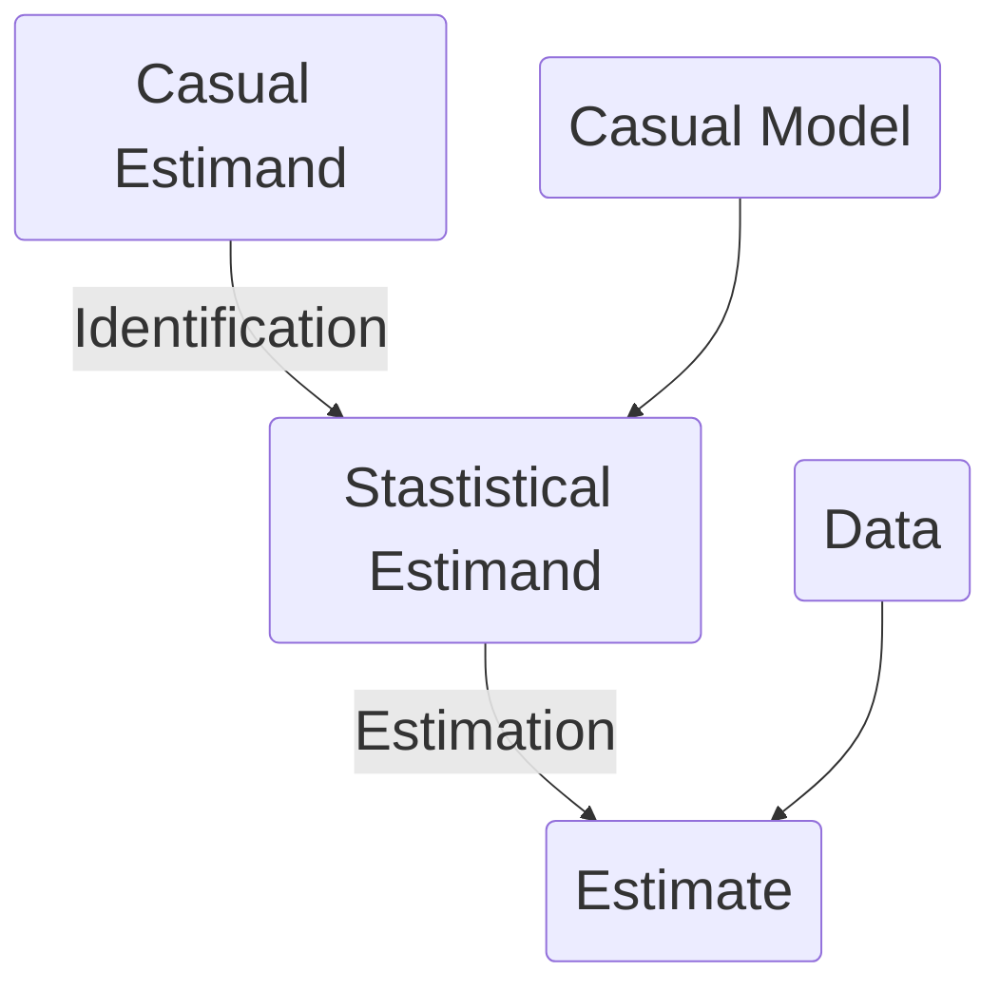
---

#### $\textbf{结构因果模型(SCM)}$
$\text{一种基于因果图(有向无环图)，构建因子间因果关系的方法}\\$
$\textbf{常见模型}$

$$\text{PS: } N_x,N_y,N_z\text{都为外生变量; }X,Y,Z\text{都为内生变量}$$
1. $\text{链式(Chain)\quad可直接进行统计分析}$
$\textcolor{red}{Rule1: } X\perp(Z|Y)\ \& X\not\perp Z$
$\text{串联切断任意Y；并联切断所有Y，则 }X\perp Z$
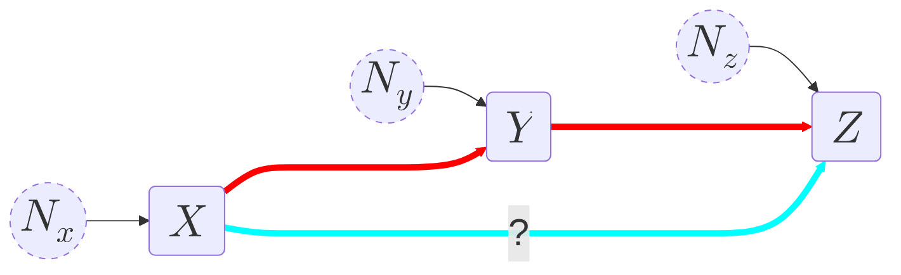
$$
\begin{aligned}
X&=f_{x}(U_x) \\
Y&=f_{y}(U_y,X) \\
Z&=f_{z}(U_z,Y)
\end{aligned}
$$

2. $\text{叉式(Fork)}$
$\textcolor{red}{Rule2: } X\perp(Z|Y)\ \& X\not\perp Z$
$\text{串联切断任意Y；并联切断所有Y，则 }X\perp Z$
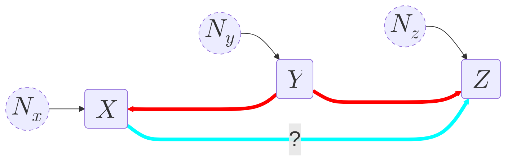
$$
\begin{aligned}
X&=f_{x}(U_x,Y) \\
Y&=f_{y}(U_y) \\
Z&=f_{z}(U_z,Y)
\end{aligned}
$$

3. $\text{V式(Collider)}$
$\textcolor{red}{Rule3: }X\not\perp(Z|Y)\ \& X\perp Y$
$\text{切断Y及Y的任意后续，则}X\not\perp Z$

 ```mermaid
%%{init:{'themeVariables':{'fontSize':'30px'}}}%%
graph LR
Nx(($$N_x$$))
Ny(($$N_y$$))
Nz(($$N_z$$))
X($$X$$)
Y($$Y$$)
Z($$Z$$)
Nx-->X
Ny-->Y
Nz-->Z

X~~~Y~~~Z
X====>Y
Z====>Y
X==?==>Z

style Nx stroke-dasharray:5
style Ny stroke-dasharray:5
style Nz stroke-dasharray:5
linkStyle 5 stroke:#FF0000,stroke-width:5px
linkStyle 6 stroke:#FF0000,stroke-width:5px
linkStyle 7 stroke:#00FFFF,stroke-width:5px
```
$$
\begin{aligned}
X&=f_{x}(U_x) \\
Y&=f_{y}(U_y,X,Z) \\
Z&=f_{z}(U_z)
\end{aligned}
$$

$\textcolor{red}{ps: Y=C时, 则X\&Y之间一定保持某种数量关系才能使得Y不变，}\\\qquad\textcolor{red}{即X与Z相关}$

4. $\text{PS:}$
   - $\text{并联: }$
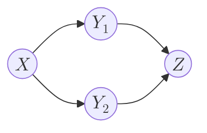
   - $\text{串联: }$
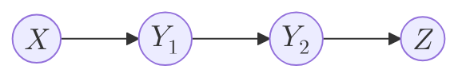
   - $\text{后续: (Y2是Y1后续)}$


$\textbf{D-Seperate}$
- $\text{D-Seperate}$
$\text{If: } X\perp Z\quad\text{Then: X, Z is D-Seperate}$
- $\text{condition D-Seperate}$
- $\text{If: } X\perp (Z|Y)\quad\text{Then: X, Z is condition Y D-Seperate}$
- $\textcolor{red}{若变量X，Z是D-Seperate或condition D-Seperate}\\\textcolor{red}{则可直接使用统计模型研究这两个变量}$
- $\textcolor{red}{若X,Z之间任意路径都是D-Seperate\implies}\\\textcolor{red}{则X,Z是D-Seperate的}$

$\textbf{模型检验}$
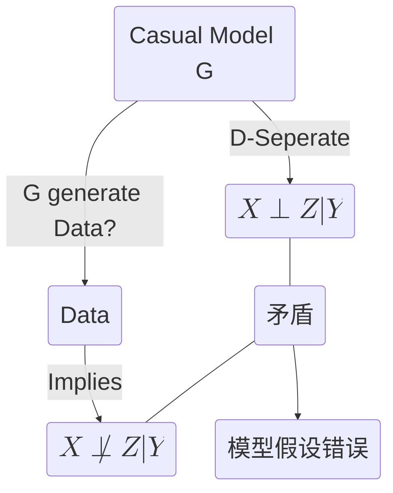
$\text{在其中，Implies的方法为线性回归，即}$
$$
Z=\beta_{0}+\beta_{X}X+\beta_{Y}Y\\
\textbf{If: } \beta_{X}\neq0\quad\textbf{Then: }X\not\perp Z|Y
$$
$\textbf{等价类}$
- $\text{使用统计方法无法区分的两类模型}$
- $\text{Fork \& Chain 是等价类}$
- $\text{Collider with adjacent parents 是等价类}$
- $\text{adjacent parent}$
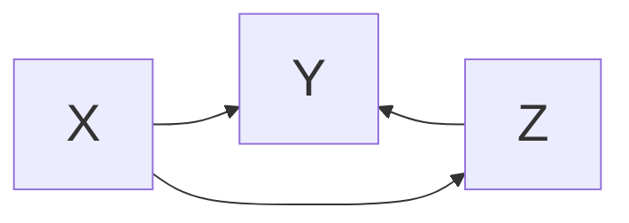
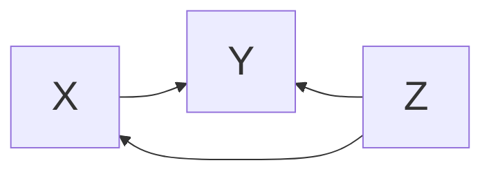
- $\textbf{如何比较两个图是否为等价类}$
$\text{若两图对应位置子图为等价类，则去掉该子图边上的方向，}\\\text{仅比较非等价类位置}$

$\textbf{乘积分解法则}$
$$
P(X_1,X_2,\cdots,X_k)=\prod_{i=1}^{n}P(X_i|pa(X_i))\\pa(X_i): X_i\text{的所有父节点}
$$
- E.g.
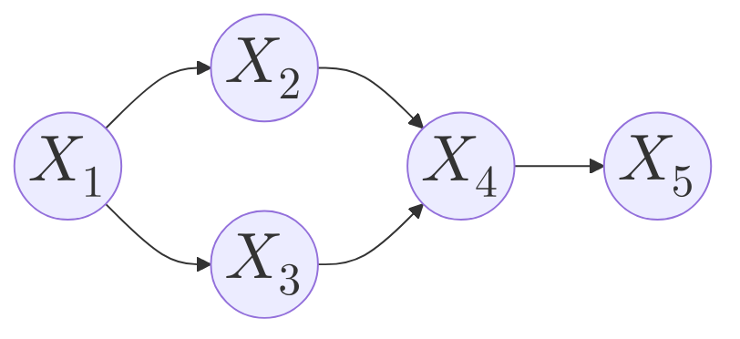
$$
\begin{aligned}
P(X_1)=&P(X_1)\\
P(X_1,X_2)=&P(X_2|X_1)P(X_1)\\
P(X_1,X_2,X_3)=&P(X_3|X_1)P(X_2|X_1)P(X_1)\\
P(X_1,X_2,X_3,X_4)=&P(X_4,|X_2,X_3)P(X_3|X_1)P(X_2|X_1)P(X_1)\\
P(X_1,X_2,X_3,X_4,X_5)=&P(X_5|X_4)P(X_4,|X_2,X_3)P(X_3|X_1)\\
&P(X_2|X_1)P(X_1)\\
\end{aligned}
$$
$\text{Proof: }$
$$
\begin{aligned}
P(X_1,X_2,X_3,X_4,X_5)=&P(X_5|X_4,X_3,X_2,X_1)\cdot\\
&P(X_4|X_3,X_2,X_1)\cdot P(X_3,X_2,X_1)\cdot\\
&P(X_3|X_2,X_1)\cdot P(X_2|X_1)\cdot P(X_1)
\end{aligned}\\
\begin{cases}
condition(X_4)\implies X_3,X_2,X_1\perp X_5\\
condition(X_3,X_2)\implies X_1\perp X_4\\
condition(X_1)\implies X_2\perp X_3
\end{cases}\implies\\
\begin{cases}
P(X_5|X_4,X_3,X_2,X_1)=P(X_5|X_4)\\
P(X_4|X_3,X_2,X_1)=P(X_4,|X_2,X_3)\\
P(X_3|X_2,X_1)=P(X_3|X_1) 
\end{cases}
$$

$\textbf{混淆变量: Confounder}$
$\text{混淆变量同时对原因变量和结果变量有影响}$
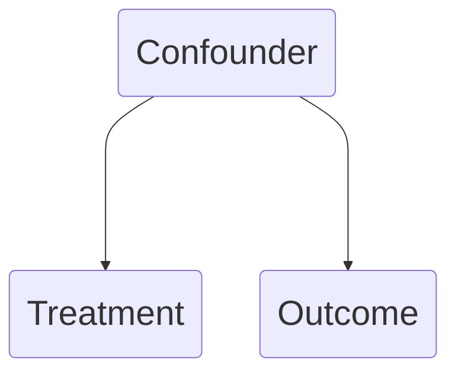
$$
\begin{cases}
\text{Treatment: } &原因变量\\
\text{Outcome: } &结果变量\\
\text{Confounder: } &混淆变量
\end{cases}
$$
- $\textbf{观测数据：}$
$\text{调查者为对环境没做出任何影响而得到的数据}\\
\text{存在Confounder，需剔除后再分析}$
- $\textbf{随机试验数据：AB-test}$ 
$\text{调查者为对环境做出干预而得到的数据}\\
\text{干预组与对照组在混淆变量的分布上是相同的，}\\\text{因此可以忽略Confounder带来的影响}\\\textcolor{red}{因果性=相关性}$

$\textbf{干预：Intervention}$


$\text{为了将观测数据转化为随机试验数据, 需要对Treatment进行干预。}$
$\text{对Treatment进行干预后，将会去掉所有指向Treatment的边。}$

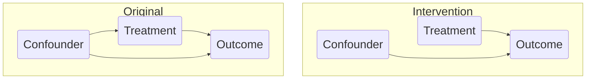
$\text{Notation: }$
$$
\begin{aligned}
Y:\quad& Outcome\\
Z:\quad& Confounder\\
do(T=C):\quad& do算子，表示对T进行干预\\
P(Y|T=C):\quad&观测值中当T=C时，Y的分布\\
P_m(Y|T=C):\quad&进行干预do(T=C)时，Y的分布\\
\end{aligned}\\
P(Y|T=C)\neq P_m(Y|T=C)=P(Y|do(T=C))\\
\textcolor{red}{在Treatment无混淆变量影响时: } P(Y|T=C)\neq P_m(Y|T=C)
$$
$\text{调整公式：}$
$调整公式是一种计算干预后Y分布\ P(Y|do(T=C))的方法$
$$
ACE(ATE)=
\begin{cases}
P(Y=y|do(T=C_1))-P(Y=y|do(T=C_2))\\
\mathbb{E}(Y=y|do(T=C_1))-\mathbb{E}(Y=y|do(T=C_2))
\end{cases}\\
\quad\\
\begin{aligned}
P(Y=y|do(T=C))=&\sum_{Z}P(Y=y|T=C,Z=z)\cdot P(Z=z)\\
\mathbb{E}(Y=y|do(T=C))=&\mathbb{E}_Z[\mathbb{E}_{Y|X,Z}(Y=y|T=C,Z)]
\end{aligned}
$$

$\text{Proof: } $
$$
\begin{aligned}
P(Y=y|do(T=C))&=P_m(Y=y|T=C)\\
&=\sum_{Z}P_m(Y=y,Z=z|T=C)\\
&=\sum_{Z}P_m(Y=y|T=C,Z=z)\cdot P_m(Z=z|T=C)\\
\end{aligned}\\
\because P_m(Z=z|T=C)=P(Z=z)\\
[\textcolor{red}{X对Z无反作用}]\\
\because P_m(Y=y|T=C,Z=z)=P(Y=y|T=C,Z=z)\\
[\textcolor{red}{conditionZ后,若T与Y无因果关系,则T与Y独立}]\\
\therefore P(Y=y|do(T=C))=\sum_{Z}P(Y=y|T=C,Z=z)\cdot P(Z=z)
$$

$\text{结果模型：}$
$\text{在遇到离散变量(结果,混淆)时可直接求取离散分布，并得到gap}\\\text{在遇到连续变量(结果,混淆)时可使用线性回归得到分布期望，并得到gap}$
$
\mathbb{E}_Z[\mathbb{E}_{Y|X,Z}(Y=y|T=C,Z)=\beta_0+\beta_TT+\beta_ZZ\\
\quad\\
\mathbb{E}(Y=y|do(T=C_1))-\mathbb{E}(Y=y|do(T=C_2))\\
=\beta_0+\beta_TC_1+\beta_ZZ-(\beta_0+\beta_TC_2+\beta_ZZ)\\
=\beta_T(C_1-C_2)
$

---

#### $\textbf{潜在结果框架(Rubin因果模型)(RCM)}$
##### $\textbf{内生性问题}$
$\text{Definition: } $
$\text{In: } y=X\beta+\varepsilon\implies\mathbb{E}(\varepsilon|X)\neq0$

##### $\textbf{内生性问题常见形式}$
1. $\text{遗漏解释变量: }$
$\text{部分解释变量没有纳入到模型中，而是遗漏在误差项内}$
$$
\text{解决方法}
\begin{cases}
\text{增加控制变量}\\
\text{采用固定效应模型(FEM)}
\end{cases}
$$

2. $\text{测量误差: }$
$\text{解释变量或被解释变量因测量误差导致一部分进入误差项中}$
3. $\text{选择偏误: }$
$$
\begin{cases}
\text{样本选择偏误: 在选择样本的时候并非随机的,}\\
\qquad\qquad\qquad\text{而是选择了都存在某一特征的样本}\\
\text{自选择偏误: 在进行干预时的时候并非随机的,}\\
\qquad\qquad\qquad\text{而是干预了都存在某一特征的特定样本}\\
\end{cases}
$$
$$
\text{解决方法}
\begin{cases}
\text{样本选择偏误: Henkman两步法}\\
\text{自选择偏误: 倾向匹配得分-双重差分法(PSM-DID),断点回归设计(RDD)}
\end{cases}
$$

4. $\text{反向因果: }$
$\text{反向因果(互为因果)是误差遗漏的一种特殊情况}$
$$
\text{解决方法: 工具变量法}
$$

##### $\textbf{解决内生性问题的基本模型}$
- $\text{固定效应模型FEM}$