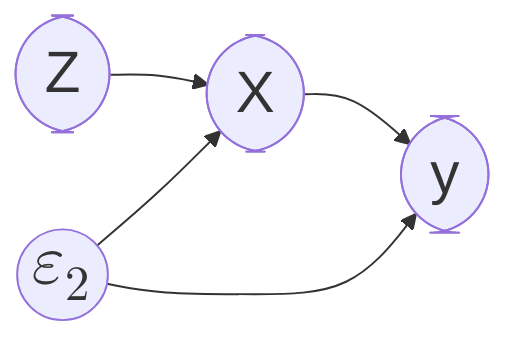

### $\textbf{内生性问题}$
#### $\textbf{内生性是什么？}$
$\textbf{- 模型中的一个或多个变量与随机扰动项}\mathbf{\varepsilon}\textbf{有关}$

$\textbf{- 导致OLS无法获得Unbias-Estimate}$

#### $\textbf{E.g.}$
$\textbf{True Model: }$
$$\textbf{Wage} = \mathbf{\beta_{1}}\textbf{Educate}+\mathbf{\beta_{2}}\textbf{Ability}+\mathbf{\varepsilon_{1}}$$

$\textbf{Assume Model: }$
$$\textbf{Wage} = \mathbf{\beta_{1}}\textbf{Educate}+\mathbf{\varepsilon_{2}}$$

$\mathbf{\because Cov(Educate, Ability)\neq 0}\\\quad\mathbf{Ability\in\varepsilon_{2}}\\
\mathbf{\therefore Cov(Educate, \varepsilon_{2})\neq 0}$

#### $\textbf{产生内生性的原因？}$
- $\textbf{测量误差}$
$\quad$
- $\textbf{遗漏变量，见E.g.}$
$\quad$
- $\textbf{样本选择性偏差}$
$\textbf{\{样本选择性偏差是遗漏变量的一种特殊情况。}\\\textbf{即因样本抽取不均匀，}\\\textbf{导致所选样本中蕴含某种未考虑到特征\}}$
$\quad$
- $\textbf{互为因果 (x,y互为因果)}$
$$
\because
\begin{cases}
y=\beta_{1}x+\varepsilon_{1},\quad Cov(x,\varepsilon_{1})=0\\
x=\beta_{2}y+\varepsilon_{2},\quad Cov(y,\varepsilon_{2})=0
\end{cases}\\
\quad\\
\therefore y=\beta_{1}\beta_{2}y+\beta_{1}\varepsilon_{2}+\varepsilon_{1},\quad Cov(y,\varepsilon_{1})\neq0
$$

#### $\textbf{工具变量法}$
- $\textbf{什么是工具变量Z？}$
  $
  \textbf{若Z满足}
  \begin{cases}
  Cov(Z,X)\neq0\\
  Cov(Z,\varepsilon)=0
  \end{cases}，
  \textbf{则Z为工具变量}
  $

- $\textbf{如何使用工具变量Z？}$
$\textbf{两阶段最小二乘法 2SLS}$
$$
\begin{align}
x&=\beta_{1}z+\varepsilon_{1}\\
y&=\beta_{2}x+\varepsilon_{2}\\
y&=\beta_{2}\beta_{1}z+\beta_{2}\varepsilon_{1}+\varepsilon_{2}
\end{align}
$$
$\mathbf{Stage1：利用式(3), 使用OLS求解出\widehat{\beta_{2}\beta_{1}}}\\
 \mathbf{Stage2：利用式(1), 使用OLS求解出\hat{\beta_{1}}, 进而得到\hat{\beta_{2}}=\frac{\widehat{\beta_{2}\beta_{1}}}{\hat{\beta_{1}}}}$

- $\textbf{工具变量法的检验}$
$$
\textbf{三类识别程度}
\begin{cases}
\textbf{不可识别: 工具变量个数<内生变量个数}\\
\textbf{恰好识别: 工具变量个数=内生变量个数}\\
\textbf{过度识别: 工具变量个数>内生变量个数}
\end{cases}
$$

$\textbf{过度识别检验}$
$H_0:\textbf{工具变量均外生}$
$\quad$
$\textbf{检验自变量是否内生}$
$\textbf{DWH检验}$
$\quad$
$\textbf{弱相关性检验}$
$\textbf{当Z与X相关性较弱时，}\mathbf{\hat{\beta_{2}}=\frac{\widehat{\beta_{2}\beta_{1}}}{\hat{\beta_{1}}}}\textbf{的估计值方差较大，}\\\textbf{因此需保证Z与X相关性较强}\\$
$\textbf{在对检验进行判别时，若Z与X相关性较强时，一阶段回归结果中}\\\textbf{偏}R^2\textbf{较大，F值>10, Minmum Eigenvalue statistic的值应大于}\\\textbf{2SLS size of nominal 5\% Wald test中的所有值}$